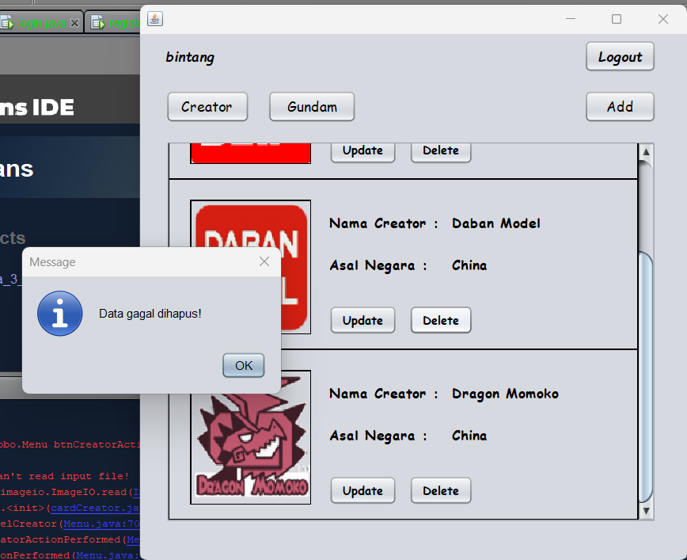

# TP2DPBO2023
Saya Muhammad Cahyana Bintang Fajar NIM 2102665 mengerjakan TP2 dalam mata kuliah Desain dan Pemrograman Berorientasi Objek untuk keberkahanNya maka saya tidak melakukan kecurangan seperti yang telah dispesifikasikan. Aamiin.

## Desain Database

pada program ini terdapat 3 tabel yaitu `akun`, `creator`, dan `gundam`
- `akun` : terdapat 4 kolom, yaitu id, nama, username dan password
- `creator` : terdapat 4 kolom, yaitu id, nama_creator, asal_negara, dan logo_creator
- `gundam` : terdapat 6 kolom, yaitu id, nama_gundam, creator_gundam, jenis_gundam, ukuran_gundam dan gambar_gundam, creator_gundam disini menjadi fk mengambil nama dari kolom creator melalui id

## Desain Program

Pada program ini terdapat 8 class yaitu `login`, `register`, `dbConnection`, `cardCreator`, `cardGundam`, `addCreator`, `addGundam`, dan `Menu` dengan class `Login` sebagai main.
- `dbConnection` : class ini hanya class biasa yang fungsinya untuk mengkoneksikan program dengan database

- `login` : ini adalah class yang dibuat dengan JFrame, sebelum kita mengakses inti dari program, kita diharuskan untuk `login` terlebih dahulu jika sudah mempunyai akun, jika belum, maka ada pilihan `register`, pada class `login` nantinya akan di validasi dengan data yang ada di database, jika valid maka kita akan masuk ke `Menu`, jika tidak, maka akan menampilkan message `login` gagal

- `register` : ini adalah class yang dibuat dengan JFrame, didalamnya terdapat username, nama, dan password, password itu harus diketikkan 2x, untuk validasi, jika password berbeda, maka akan menampilkan message password tidak sama, jika berhasil maka akan kembali ke menu `login` untuk login, lalu terdapat button back untuk balik lagi ke menu `login`, perlu diingat bahwa username disini harus Unik, artinya jika memasukan username yang sudah ada di database sebelumnya, maka akan mengeluarkan pesan username sudah ada.

- `Menu` : ini adalah class yang dibuat dengan JFrame, class ini fungsinya sebagai class utama dari program ini, didalamnya terdapat JPanel untuk menyimpan data dan juga JScrollPane supaya bisa di scroll apabila terdapat banyak data, lalu ada String nama itu fungsinya untuk mengetahui siapa yang sedang `login`, ini diambil dari nama pada saat kita login, lalu ada 2 panel yaitu panel gundam dan panel creator, ada juga logout, logout ini akan membawa kita balik lagi ke menu `login`, lalu ada add, add ini dinamis, jadi ketika sedang berada di panel gundam maka akan meng `addGundam`, ketika di panel creator maka akan meng `addCreator`

- `cardCreator` : ini adalah class yang dibuat dengan JPanel, isinya itu diambil dari database, ada gambar, asal negara dan nama creator, lalu terdapat beberapa atribut bantuan untuk menyimpan gambar, didalam class ini terdapat method  deleteData() untuk menghapus data dari database, lalu untuk updatenya itu nanti dialihkan ke `addGundam` di frame `addGundam`, saya mengubah addnya menjadi update, jadi nanti ketika update datanya otomatis terisi data yang akan kita update

- `cardGundam` : ini adalah class yang dibuat dengan JPanel, kurang lebih sama dengan `cardCreator` tadi, tapi perbedaannya adalah ketika memilih creator, itu berupa combobox yang didalamnya adalah beberapa creator yang sudah ditambahkan di database, jadi ngedropdown dari yang creator itu

- `addCreator` : ini adalah class yang dibuat dengan JFrame, class ini berisi field yang fungsinya untuk menambah dan update data, didalamnya ada boolean isUpdate yang berfungsi sebagai flag apakah sedang update atau sedang add, lalu berisi beberapa atribut bantuan untuk mengolah gambar, terdapat 4 method didalamnya, yaitu updateData(), addData(), copyImage(), insertData(), dan resetForm(), lalu ketika upload image akan tersimpan di folder image

- `addGundam` : ini adalah class yang dibuat dengan JFrame, class ini mempunyai fungsi yang kurang lebih sama dengan addCreator, bedanya, field untuk creator berupa comboBox yang sebelumnya dijelaskan di `cardGundam`

## Alur Program
1. pertama, jika sudah mempunyai akun langsung saja login
- username : bintang
- password : bintang
bisa register terlebih dahulu, jika ingin membuat akun baru
2. jika sudah login maka akan menuju ke frame `Menu`, didalamnya, anda bisa melihat panel gundam atau panel creator
3. jika ingin menambahkan gundam yang creatornya belum ada di daftar creator, maka add Creator, arahkan dulu ke panel creator melalui button creator, setlah itu add, lalu akan menuju ke frame `addCreator`, isi datanya
4. setelah mengisi data creator, maka arahkan ke panel gundam melalui tombol gundam, lalu langsung add saja otomatis ke panel `addGundam`, isi datanya 
5. jika sudah mengisi, anda bisa juga menghapusnya dengan cara pilih card mana yang akan dihapus, lalu klik delete, perlu diketahui bahwa sebelum menghapus creator, anda harus menghapus gundamnya terlebih dahulu jika ada, karena akan terjadi error jika anda langsung menghapus creatornya tanpa menghapus gundamnya terlebih dahulu, karena kedua hal ini berelasi 
6. anda juga bisa mengupdate data, jika dirasa datanya ingin di ubah, cukup klik tombol update di setiap card, nantinya akan diarahkan ke frame `addGundam`, tetapi bedanya, fieldnya akan langsung terisi sesuai data yang akan kita update
7. jika sudah selesai, anda bisa logout saja, atau bisa langsung close programnya

*setelah saya coba coba ternyata terkadang jar filenya nggak bisa dibuka, jadi jalankan lewat apache netbeans aja*

## Desain GUI
### Login.Java

### Register.Java

### Menu.Java

### cardCreator.Java

### cardGundam.Java

### addCreator.Java

### addGundam.Java

## Dokumentasi
### login Success

### login failed(username /password salah)

### register success

### register fail (username sudah ada di db)

### register fail (password tidak sama)

### add creator 

### add gundam 

### update

### delete success

### delete fail(karena creator terpakai di gundam)

